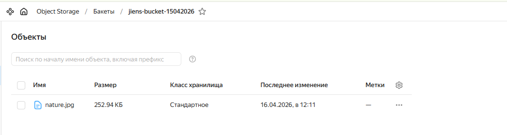
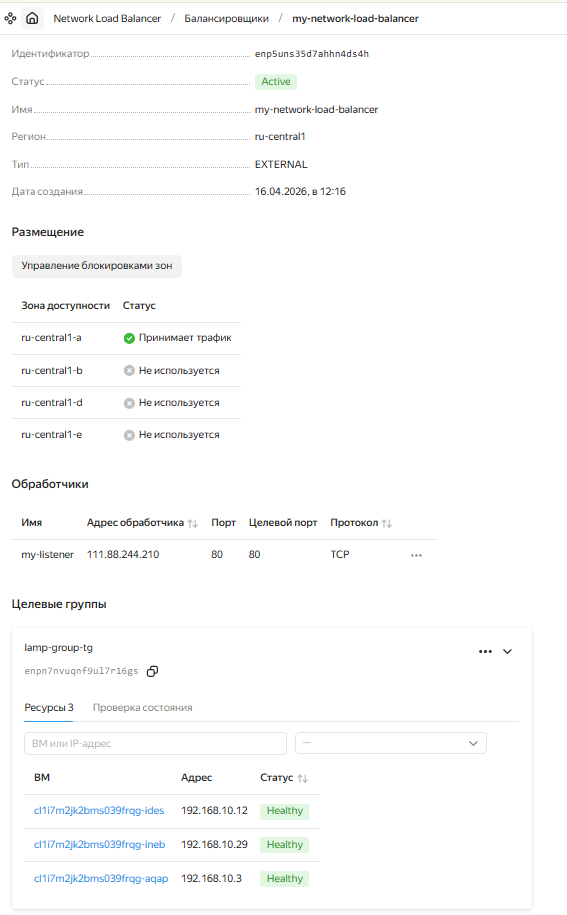
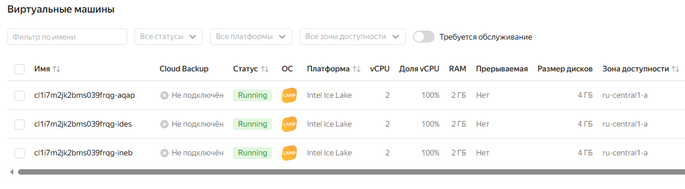
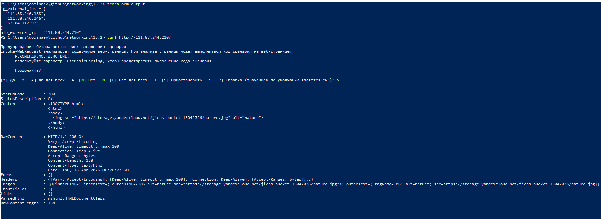

# Домашнее задание к занятию «Организация сети»

## Подготовка к выполнению задания

Подготовка окружения (установка Terraform, настройка провайдера, создание сервисного аккаунта, генерация ключей) описана в [первой домашней работе](https://github.com/Jienshakh/networking-netology/blob/main/15.1/15.1.md#%D0%BF%D0%BE%D0%B4%D0%B3%D0%BE%D1%82%D0%BE%D0%B2%D0%BA%D0%B0-%D0%BA-%D0%B2%D1%8B%D0%BF%D0%BE%D0%BB%D0%BD%D0%B5%D0%BD%D0%B8%D1%8E-%D0%B7%D0%B0%D0%B4%D0%B0%D0%BD%D0%B8%D1%8F). Далее приведены шаги, специфичные для текущего задания.

## Структура репозитория

```
├── main.tf                       # Основные ресурсы: VPC, Instance Group, NLB
├── variables.tf                  # Объявление всех переменных
├── providers.tf                  # Конфигурация провайдера Yandex Cloud
├── outputs.tf                    # Выходные параметры (IP-адреса, информация о ВМ)
├── storage.tf                    # Бакет Object Storage и загрузка картинки
├── user-data.sh.tpl              # Шаблон скрипта для инициализации ВМ
├── nature.jpg                    # Локальный файл с картинкой для загрузки в бакет
├── personal.auto.tfvars          # Персональные переменные (игнорируется git)
├── personal.auto.tfvars.example  # Пример персональных переменных
└── 15.2.md                       # Данный файл документации
```

## Развернутая инфраструктура

### 1. Object Storage (бакет)

- **Бакет**: `jiens-bucket-15042026`
- **Максимальный размер**: 10 МБ
- **Публичный доступ**: включён (чтение объектов разрешено анонимно)
- **Загруженный объект**: `nature.jpg` (локальный файл `./nature.jpg`)
- **URL для публичного доступа**:
```text
https://storage.yandexcloud.net/jiens-bucket-15042026/nature.jpg
```

### 2. Сеть (VPC)

- **VPC Network**: `lab-network`
- **Публичная подсеть** (`public`): `192.168.10.0/24`, зона `ru-central1-a`

### 3. Instance Group (группа ВМ с LAMP)

**Имя группы:** `lamp-group`  
**Количество ВМ:** 3

#### Шаблон ВМ

- **Платформа:** `standard-v3`
- **Ресурсы:** 2 vCPU, 2 ГБ RAM
- **Диск:** 4 ГБ, образ `fd827b91d99psvq5fjit` (LAMP)
- **Сеть:** публичная подсеть, автоматический публичный IP (`nat = true`)

#### Метаданные

- **user-data** — bash-скрипт, создающий `/var/www/html/index.html` со ссылкой на картинку из бакета:

    

- **ssh-keys** — публичный ключ для пользователя `ubuntu`

#### Политика развёртывания

- `max_unavailable = 2`
- `max_creating = 2`
- `max_expansion = 2`
- `max_deleting = 2`

#### Проверка состояния (Health Check)

- **Протокол:** HTTP  
- **Порт:** 80  
- **Путь:** `/`  
- **Интервал:** 30 сек  
- **Таймаут:** 10 сек  
- **Порог:** 2 успеха / 2 неудачи  

#### Целевая группа

Создаётся автоматически: `lamp-group-tg`

---

## 4. Сетевой балансировщик (Network Load Balancer)

**Имя:** `my-network-load-balancer`

### Listener

- **Порт:** 80  
- **Целевой порт:** 80  
- **Тип:** внешний IPv4  

### Привязка к целевой группе

    target_group_id = yandex_compute_instance_group.lamp_group.load_balancer.0.target_group_id

### Проверка состояния балансировщика (Health Check)

- **Протокол:** HTTP  
- **Порт:** 80  
- **Путь:** `/`  
- **Интервал:** 30 сек  
- **Таймаут:** 10 сек  
- **Порог:** 2 успеха / 2 неудачи  

## Проверка работоспособности

### 1. Получить внешний IP балансировщика:

```bash
terraform output -raw nlb_external_ip
```

### 2. Открыть веб-страницу через балансировщик:

```bash
curl http://$(terraform output -raw nlb_external_ip)/
```
### 3. Проверить отказоустойчивость:

- Вручную удалить одну из ВМ в консоли Yandex Cloud.
- Instance Group автоматически пересоздаст её.
- Балансировщик перестанет направлять трафик на удалённую ВМ (health check провалится) и начнёт снова, когда новая ВМ станет здоровой.

### 4. Проверить IP-адреса всех ВМ группы:

```bash
terraform output ig_external_ips
```
Вывод – список публичных IP трёх инстансов. К каждому можно подключиться по SSH:

```bash
ssh -i ~/.ssh/id_ed25519_yd ubuntu@<public_vm_ip>
```


## Выходные параметры

После применения конфигурации команда terraform output отображает:

- `ig_external_ips` — Список публичных IP-адресов всех ВМ в группе

- `nlb_external_ip` — Публичный IP-адрес сетевого балансировщика

## Скриншоты

- Бакет и объект


- Балансировщик


- Instance Group (группа ВМ с LAMP)


Ответ балансировщика

---

# Домашнее задание к занятию «Вычислительные мощности. Балансировщики нагрузки»  

### Подготовка к выполнению задания

1. Домашнее задание состоит из обязательной части, которую нужно выполнить на провайдере Yandex Cloud, и дополнительной части в AWS (выполняется по желанию). 
2. Все домашние задания в блоке 15 связаны друг с другом и в конце представляют пример законченной инфраструктуры.  
3. Все задания нужно выполнить с помощью Terraform. Результатом выполненного домашнего задания будет код в репозитории. 
4. Перед началом работы настройте доступ к облачным ресурсам из Terraform, используя материалы прошлых лекций и домашних заданий.

---
## Задание 1. Yandex Cloud 

**Что нужно сделать**

1. Создать бакет Object Storage и разместить в нём файл с картинкой:

 - Создать бакет в Object Storage с произвольным именем (например, _имя_студента_дата_).
 - Положить в бакет файл с картинкой.
 - Сделать файл доступным из интернета.
 
2. Создать группу ВМ в public подсети фиксированного размера с шаблоном LAMP и веб-страницей, содержащей ссылку на картинку из бакета:

 - Создать Instance Group с тремя ВМ и шаблоном LAMP. Для LAMP рекомендуется использовать `image_id = fd827b91d99psvq5fjit`.
 - Для создания стартовой веб-страницы рекомендуется использовать раздел `user_data` в [meta_data](https://cloud.yandex.ru/docs/compute/concepts/vm-metadata).
 - Разместить в стартовой веб-странице шаблонной ВМ ссылку на картинку из бакета.
 - Настроить проверку состояния ВМ.
 
3. Подключить группу к сетевому балансировщику:

 - Создать сетевой балансировщик.
 - Проверить работоспособность, удалив одну или несколько ВМ.
4. (дополнительно)* Создать Application Load Balancer с использованием Instance group и проверкой состояния.

Полезные документы:

- [Compute instance group](https://registry.terraform.io/providers/yandex-cloud/yandex/latest/docs/resources/compute_instance_group).
- [Network Load Balancer](https://registry.terraform.io/providers/yandex-cloud/yandex/latest/docs/resources/lb_network_load_balancer).
- [Группа ВМ с сетевым балансировщиком](https://cloud.yandex.ru/docs/compute/operations/instance-groups/create-with-balancer).

---
## Задание 2*. AWS (задание со звёздочкой)

Это необязательное задание. Его выполнение не влияет на получение зачёта по домашней работе.

**Что нужно сделать**

Используя конфигурации, выполненные в домашнем задании из предыдущего занятия, добавить к Production like сети Autoscaling group из трёх EC2-инстансов с  автоматической установкой веб-сервера в private домен.

1. Создать бакет S3 и разместить в нём файл с картинкой:

 - Создать бакет в S3 с произвольным именем (например, _имя_студента_дата_).
 - Положить в бакет файл с картинкой.
 - Сделать доступным из интернета.
2. Сделать Launch configurations с использованием bootstrap-скрипта с созданием веб-страницы, на которой будет ссылка на картинку в S3. 
3. Загрузить три ЕС2-инстанса и настроить LB с помощью Autoscaling Group.

Resource Terraform:

- [S3 bucket](https://registry.terraform.io/providers/hashicorp/aws/latest/docs/resources/s3_bucket)
- [Launch Template](https://registry.terraform.io/providers/hashicorp/aws/latest/docs/resources/launch_template).
- [Autoscaling group](https://registry.terraform.io/providers/hashicorp/aws/latest/docs/resources/autoscaling_group).
- [Launch configuration](https://registry.terraform.io/providers/hashicorp/aws/latest/docs/resources/launch_configuration).

Пример bootstrap-скрипта:

```
#!/bin/bash
yum install httpd -y
service httpd start
chkconfig httpd on
cd /var/www/html
echo "<html><h1>My cool web-server</h1></html>" > index.html
```
### Правила приёма работы

Домашняя работа оформляется в своём Git репозитории в файле README.md. Выполненное домашнее задание пришлите ссылкой на .md-файл в вашем репозитории.
Файл README.md должен содержать скриншоты вывода необходимых команд, а также скриншоты результатов.
Репозиторий должен содержать тексты манифестов или ссылки на них в файле README.md.
