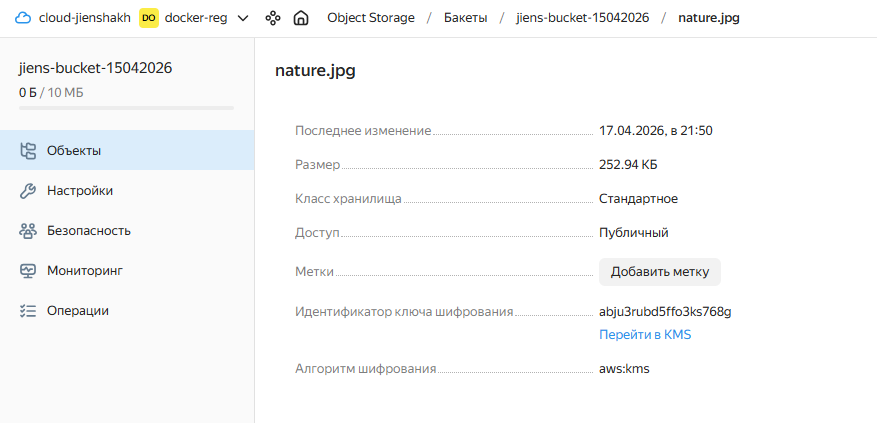
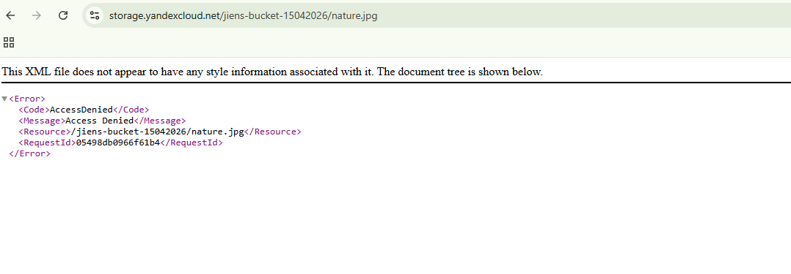

# Домашнее задание к занятию «Организация сети»

## Подготовка к выполнению задания

1. Подготовка окружения (установка Terraform, настройка провайдера, создание сервисного аккаунта, генерация ключей) описана в [первой домашней работе](https://github.com/Jienshakh/networking-netology/blob/main/15.1/15.1.md#%D0%BF%D0%BE%D0%B4%D0%B3%D0%BE%D1%82%D0%BE%D0%B2%D0%BA%D0%B0-%D0%BA-%D0%B2%D1%8B%D0%BF%D0%BE%D0%BB%D0%BD%D0%B5%D0%BD%D0%B8%D1%8E-%D0%B7%D0%B0%D0%B4%D0%B0%D0%BD%D0%B8%D1%8F). 
2. 
Далее приведены шаги, специфичные для текущего задания.

## Структура репозитория

```
├── main.tf                       # Основные ресурсы: KMS, Object Storage
├── variables.tf                  # Объявление всех переменных
├── providers.tf                  # Конфигурация провайдера Yandex Cloud
├── nature.jpg                    # Локальный файл с картинкой для загрузки в бакет
├── personal.auto.tfvars          # Персональные переменные (игнорируется git)
├── personal.auto.tfvars.example  # Пример персональных переменных
└── 15.3.md                       # Данный файл документации
```

## Развернутая инфраструктура

### 1. Object Storage (бакет)

| Параметр | Значение |
|----------|----------|
| **Бакет** | `jiens-bucket-15042026` |
| **Максимальный размер** | 10 МБ |
| **Публичный доступ** | чтение, список, чтение конфигурации (анонимно) |
| **Загруженный объект** | `nature.jpg` |
| **URL** | `https://storage.yandexcloud.net/jiens-bucket-15042026/nature.jpg` |

**Шифрование KMS:**
- **Ключ:** `my-symetric-key`
- **Алгоритм:** `AES_128`
- **Ротация:** 8760ч (1 год)
- **Режим:** `aws:kms` (серверное шифрование)


## Скриншоты

### Бакет и объект (видно идентификатор шифрования)


### Ответ при при попытке получить зашифрованный объект в браузере


---

# Домашнее задание к занятию «Безопасность в облачных провайдерах»  

Используя конфигурации, выполненные в рамках предыдущих домашних заданий, нужно добавить возможность шифрования бакета.

---
## Задание 1. Yandex Cloud   

1. С помощью ключа в KMS необходимо зашифровать содержимое бакета:

 - создать ключ в KMS;
 - с помощью ключа зашифровать содержимое бакета, созданного ранее.
2. (Выполняется не в Terraform)* Создать статический сайт в Object Storage c собственным публичным адресом и сделать доступным по HTTPS:

 - создать сертификат;
 - создать статическую страницу в Object Storage и применить сертификат HTTPS;
 - в качестве результата предоставить скриншот на страницу с сертификатом в заголовке (замочек).

Полезные документы:

- [Настройка HTTPS статичного сайта](https://cloud.yandex.ru/docs/storage/operations/hosting/certificate).
- [Object Storage bucket](https://registry.terraform.io/providers/yandex-cloud/yandex/latest/docs/resources/storage_bucket).
- [KMS key](https://registry.terraform.io/providers/yandex-cloud/yandex/latest/docs/resources/kms_symmetric_key).

--- 
## Задание 2*. AWS (задание со звёздочкой)

Это необязательное задание. Его выполнение не влияет на получение зачёта по домашней работе.

**Что нужно сделать**

1. С помощью роли IAM записать файлы ЕС2 в S3-бакет:
 - создать роль в IAM для возможности записи в S3 бакет;
 - применить роль к ЕС2-инстансу;
 - с помощью bootstrap-скрипта записать в бакет файл веб-страницы.
2. Организация шифрования содержимого S3-бакета:

 - используя конфигурации, выполненные в домашнем задании из предыдущего занятия, добавить к созданному ранее бакету S3 возможность шифрования Server-Side, используя общий ключ;
 - включить шифрование SSE-S3 бакету S3 для шифрования всех вновь добавляемых объектов в этот бакет.

3. *Создание сертификата SSL и применение его к ALB:

 - создать сертификат с подтверждением по email;
 - сделать запись в Route53 на собственный поддомен, указав адрес LB;
 - применить к HTTPS-запросам на LB созданный ранее сертификат.

Resource Terraform:

- [IAM Role](https://registry.terraform.io/providers/hashicorp/aws/latest/docs/resources/iam_role).
- [AWS KMS](https://registry.terraform.io/providers/hashicorp/aws/latest/docs/resources/kms_key).
- [S3 encrypt with KMS key](https://registry.terraform.io/providers/hashicorp/aws/latest/docs/resources/s3_bucket_object#encrypting-with-kms-key).

Пример bootstrap-скрипта:

```
#!/bin/bash
yum install httpd -y
service httpd start
chkconfig httpd on
cd /var/www/html
echo "<html><h1>My cool web-server</h1></html>" > index.html
aws s3 mb s3://mysuperbacketname2021
aws s3 cp index.html s3://mysuperbacketname2021
```

### Правила приёма работы

Домашняя работа оформляется в своём Git репозитории в файле README.md. Выполненное домашнее задание пришлите ссылкой на .md-файл в вашем репозитории.
Файл README.md должен содержать скриншоты вывода необходимых команд, а также скриншоты результатов.
Репозиторий должен содержать тексты манифестов или ссылки на них в файле README.md.
